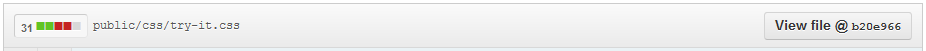
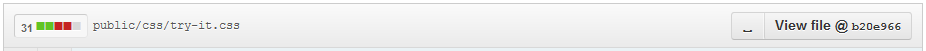
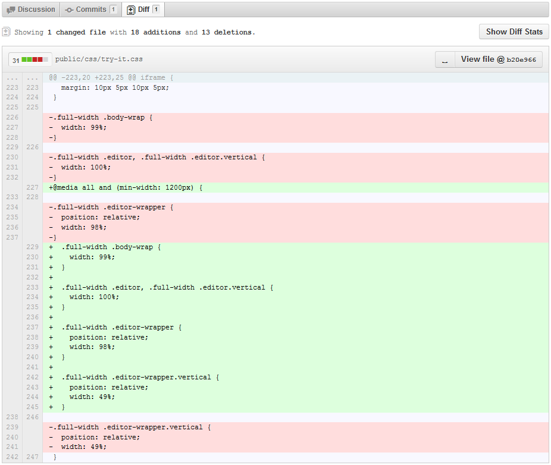
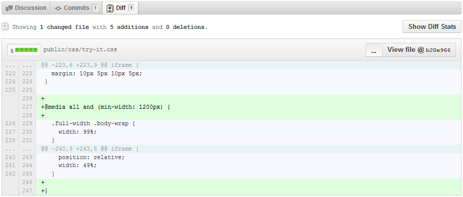

GitHub-Diff-Whitespace
===========
Adds a button to GitHub diff views (commits, pull requests) to toggle whitespace-significance for the diff.

GitHub has a hidden feature whereby adding `?w=1` to the end of any diff url will turn off whitespace significance in the diff. (essentially, the same as `git diff -w`.) This userscript simply adds a toggle button to make use of this awesome feature!

Before and After:

Effect of toggling whitespace significance:

Installation
------------
Chrome:
 - install from [Chrome Web Store](https://chrome.google.com/webstore/detail/github-diff-whitespace/lhbcdehjihmbiafeodkfnbndleijnnhp)

Firefox with Greasemonkey:
 - install from [userscripts.org](http://userscripts.org/scripts/show/137968)

Browsers
------------
Tested in Firefox (with Greasemonkey) and Google Chrome
